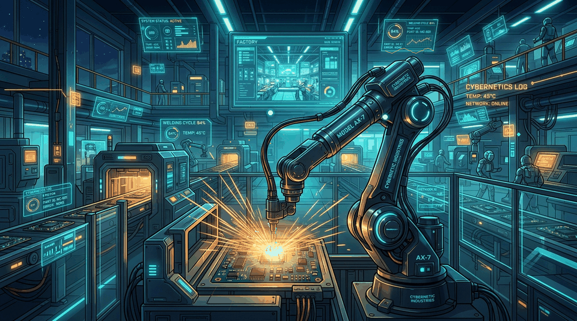

<p align="center">
  
</p>

<h1 align="center">Hi there, I'm Sirojul Kahfi 👋</h1>

<p align="center">
  <a href="https://git.io/typing-svg">
    
  </a>
</p>

<p align="center">
  
  
  
</p>

---

## 🏭 INDUSTRIAL FACTORY SCENE (Animated SVG)

<p align="center">
  
</p>

---

## ⚡ PLC LADDER DIAGRAM (LD) — SISTEM KONTROL PROFIL

<p align="center">
  
</p>

```text
+=================================================================================================+
| PROGRAM : SIROJUL_KAHFI.LD   | CPU: MITSUBISHI Q-SERIES / OMRON SYSMAC | MODE: RUN (M8000=ON) |
| STATUS  : SYSTEM OPERATIONAL | SCAN TIME: 0.24 ms                      | STEP: 0000 -> END    |
+=================================================================================================+

+--[ NETWORK 001 : TENTANG SAYA (ABOUT ME CORE PROFILE) ]----------------------------------------+
|                                                                                                  |
|  // 1.1: CORE IDENTITY & FOCUS                                                                   |
|  |--[ SM400 ]---+--[ MOV "Sirojul Kahfi - Software Dev & Industrial Automation"        D000 ]---|
|  | (Always ON)  +--[ MOV "Fokus: Web App Modern & Sistem Otomasi / Kontrol Mesin PLC"  D001 ]---|
|                                                                                                  |
|  // 1.2: WEB & SOFTWARE DEVELOPMENT                                                              |
|  |--[ M100 ]----+--[ MOV "Frontend: Next.js (App Router, SSR/SSG), React.js"           D110 ]---|
|  | (Web Core)   |--[ MOV "Styling & Logic: Tailwind CSS, TypeScript, JavaScript"       D111 ]---|
|  |              |--[ MOV "Backend & Data: Node.js, PostgreSQL, Prisma ORM, REST API"   D112 ]---|
|  |              +--[ OUT Y010_WEB_DEVELOPMENT_ACTIVE                                       ]---(Y010)
|                                                                                                  |
|  // 1.3: INDUSTRIAL AUTOMATION & ROBOTICS                                                        |
|  |--[ M200 ]----+--[ MOV "Mitsubishi PLC: FX Series, Q Series (GX Works2 / GX Works3)" D120 ]---|
|  | (Auto Core)  |--[ MOV "Omron PLC: CP Series, CJ Series (CX-Programmer, Sysmac)"     D121 ]---|
|  |              |--[ MOV "Bahasa: Ladder Diagram (LD) & Structured Text (ST)"          D122 ]---|
|  |              |--[ MOV "Robotics: Pemrograman Kontrol Mesin & Robotika Industri"     D123 ]---|
|  |              +--[ OUT Y020_INDUSTRIAL_AUTOMATION_ACTIVE                                 ]---(Y020)
|                                                                                                  |
|  // 1.4: IT / OT CONVERGENCE & SCADA INTEGRATION                                                |
|  +--[ M300 ]----+--[ MOV "Protokol: Modbus RTU/TCP, Serial RS-232/RS-485, MQTT"        D130 ]---|
|    (Bridge)     |--[ MOV "Akuisisi: Data Mesin Industri Real-Time ke Web Cloud"        D131 ]---|
|                 |--[ MOV "Monitoring: HMI, SCADA Dashboard & IoT Cloud Analytics"      D132 ]---|
|                 +--[ CALL P_IT_OT_CONVERGENCE                                          K1   ]---(Y030)
+--------------------------------------------------------------------------------------------------+

+--[ NETWORK 002 : TECH STACK & KEAHLIAN (DATA REGISTERS BMOV) ]---------------------------------+
|                                                                                                  |
|  // 2.1: WEB & CLOUD SOFTWARE ENGINEERING                                                        |
|  |--[ X001_WEB ]---+--[ BMOV D200_FE  "Next.js | React | TypeScript | Tailwind"       K4 ]-----|
|  | (Web Trig)      |--[ BMOV D204_BE  "Node.js | PostgreSQL | Prisma ORM | REST API"  K4 ]-----|
|  |                 |--[ BMOV D208_DEV "Git | GitHub | Docker Environment"             K3 ]-----|
|  |                 +--[ OUT Y100_FULLSTACK_WEB_STACK_ACTIVE                               ]---(Y100)
|                                                                                                  |
|  // 2.2: INDUSTRIAL AUTOMATION & ROBOTICS HARDWARE                                               |
|  |--[ X002_AUTO ]--+--[ BMOV D300_PLC "Mitsubishi FX/Q | Omron CP/CJ | Sysmac Studio" K3 ]-----|
|  | (Auto Trig)     |--[ BMOV D303_LAN "Ladder Diagram (LD) | Structured Text (ST)"    K2 ]-----|
|  |                 |--[ BMOV D305_COM "Modbus RTU/TCP | Serial RS-485/232 | MQTT"     K3 ]-----|
|  |                 |--[ BMOV D308_IOT "HMI / SCADA | IT/OT Realtime Web Dashboard"    K3 ]-----|
|  |                 +--[ OUT Y200_INDUSTRIAL_SYSTEMS_ACTIVE                                 ]---(Y200)
|                                                                                                  |
|  // 2.3: REAL-TIME ACTIVITY & TELEMETRY MONITOR                                                  |
|  |--[ M8013 ]--------[ PID_FEEDBACK "GITHUB_STREAK_SYNC" D500                         K10 ]---(Y300)
|                                                                                                  |
|  // 2.4: COMMUNICATION BUS & CONTACT ROUTINE                                                     |
|  +--[ X003_PING ]--+--[ COM_OPEN "LinkedIn"  "id.linkedin.com/in/sirojul-kahfi"           ]-----|
|    (Connect)       |--[ COM_OPEN "Outlook"   "sirojulkahfi@outlook.com"                   ]-----|
|                    |--[ COM_OPEN "GitHub"    "github.com/sirojulkahfi"                    ]-----|
|                    +--[ FEND ]---(END)
+--------------------------------------------------------------------------------------------------+
```

---

## 🖥️ HMI / SCADA DASHBOARD (PERIPHERAL OUTPUTS)

> Output visual dari coil PLC (`Y010_WEB`, `Y020_PLC`, `Y300_TELEMETRY`, `Y_COM`) yang terhubung ke dashboard monitoring:

#### 🌐 Web Engineering Peripherals `[COIL Y010 / Y100]`
<p align="left">
  
</p>

#### 🏭 Industrial Automation & PLC Hardware `[COIL Y020 / Y200]`
<p align="left">
  
  
  
  
  
</p>

#### 📈 Real-Time Development Streak `[COIL Y300]`
<p align="center">
  
</p>

#### 📬 Communication Port Interfaces `[COIL Y_COM]`
<p align="left">
  <a href="https://id.linkedin.com/in/sirojul-kahfi-29a170224">
    
  </a>
  &nbsp;
  <a href="mailto:sirojulkahfi@outlook.com">
    
  </a>
  &nbsp;
  <a href="https://github.com/sirojulkahfi">
    
  </a>
</p>
